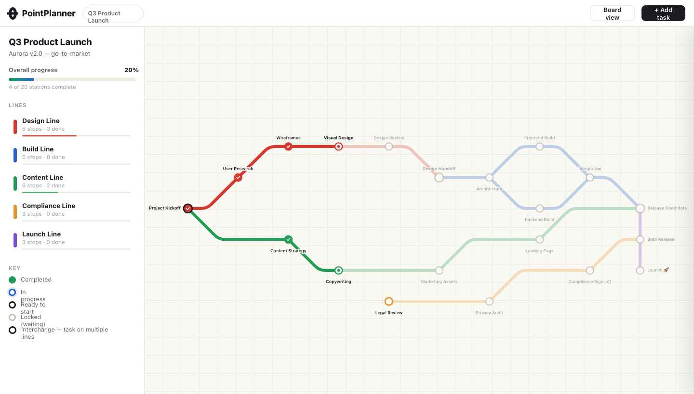

# PointPlanner

A project planner that renders work as a **transit map**. Tasks are *stations* placed on a grid; dependencies are colored *lines* drawn in 45° subway style. A task automatically unlocks once all of its prerequisites are complete, so the map doubles as a live readiness view of the whole project.

Built with **Vite + React + TypeScript**. State persists to `localStorage`.



## Features

- **Transit map** — SVG routes with rounded corners; stations show four states (locked / available / active / done) with animated halos for active and ready tasks.
- **Interchanges** — a task on more than one line is drawn larger with a dark ring.
- **Legend** — overall progress, per-line stop/done counts with mini progress bars, and click-to-highlight a single line.
- **Detail panel** — slide-in panel with status, owner, due date, estimate, "Depends on" / "Unblocks next" lists, and Start / Complete / Reopen actions that cascade through the dependency graph.
- **Create tasks** — add a station, pick its line and prerequisites; it auto-places to the right of its prerequisites with edges drawn automatically.
- **Dark theme** toggle.

## Getting started

```bash
npm install
npm run dev      # start the dev server
```

## Environment variables

PointPlanner gates the app behind passwordless sign-in backed by [Supabase](https://supabase.com).
Copy `.env.example` to `.env` (or `.env.local`) and supply your project credentials:

| Variable | Description |
| --- | --- |
| `VITE_SUPABASE_URL` | Your Supabase project URL |
| `VITE_SUPABASE_PUBLISHABLE_KEY` | The project's publishable key (`sb_publishable_…`) |

These are public client-side keys but should not be committed (`.env` / `*.local` are git-ignored).
If they are absent the app still builds and runs, but the sign-in screen shows a "not configured" notice.

> **Note:** Supabase replaced the legacy JWT `anon` / `service_role` keys with
> publishable / secret keys in 2025. This app uses only the **publishable** key
> (same low privileges as the old anon key). See [`docs/supabase-setup.md`](docs/supabase-setup.md)
> for the full setup, RLS, and auth-configuration guide.

### Sign-in flow

A signed-out visitor sees a sign-in screen. Enter an email to receive a one-time code / magic link
(`signInWithOtp`), then enter the emailed code to sign in (`verifyOtp`, `type: 'email'`). Clicking the
magic link works too via `detectSessionInUrl`. Sessions persist across reloads; the topbar **Sign out**
control returns you to the sign-in screen. Maps remain in `localStorage` for now.

## Scripts

| Command | Description |
| --- | --- |
| `npm run dev` | Start the Vite dev server |
| `npm run build` | Type-check and build for production |
| `npm run preview` | Preview the production build |
| `npm run test` | Run unit tests (Vitest) |
| `npm run lint` | Run ESLint |

## Architecture

```
src/
  types.ts            Domain types (Line, Station, Edge, Project)
  data/seed.ts        Sample "Q3 Product Launch" project
  lib/                Framework-agnostic pure logic (unit-tested)
    indexes.ts          buildIndexes → stationById / lineById / prereqs / dependents
    dependencies.ts     recompute → cascades locked ↔ available from prereq state
    routing.ts          45° edge routing + rounded-corner SVG paths + grid helpers
    bounds.ts           computeBounds → SVG viewBox
    placement.ts        slugify / auto-placement for newly created tasks
  store/projectStore.tsx   Context + useReducer; localStorage persistence
  components/         Topbar, Legend, TransitMap, Segment, StationNode,
                      DetailPanel, CreateModal
  styles/global.css   Global stylesheet (CSS custom properties + dark theme)
```

The dependency engine and geometry live in `src/lib/` as pure functions so they can be unit-tested in isolation; everything visual is a thin React layer over that logic.

## Design reference

`design/` contains the original Claude Design handoff bundle (HTML/CSS/JS prototype and screenshots) that this implementation is based on.
